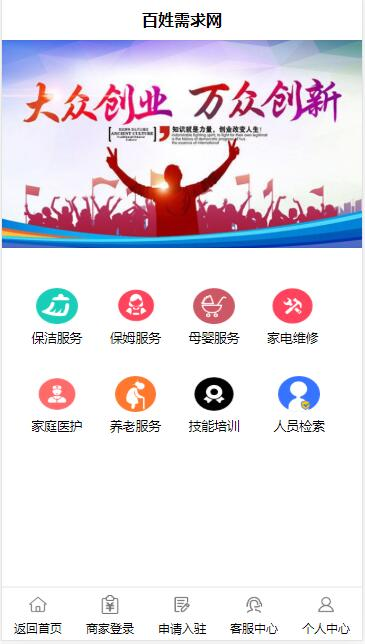
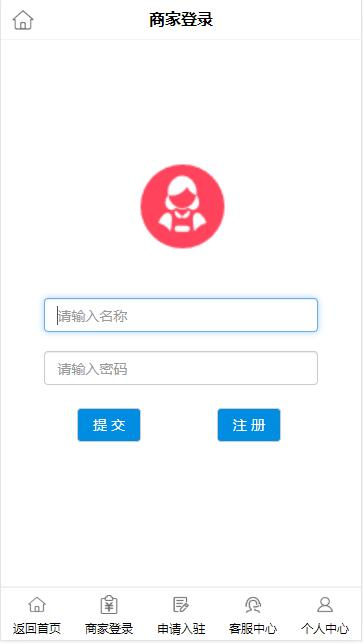
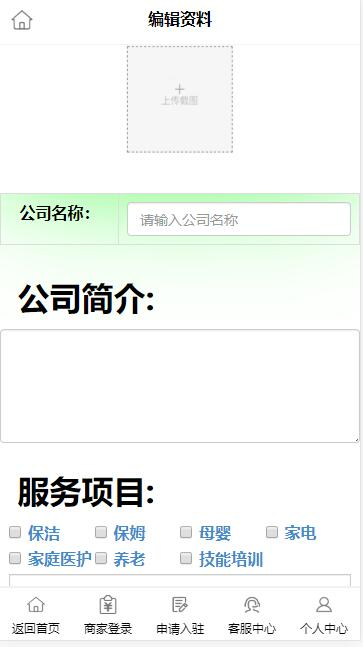
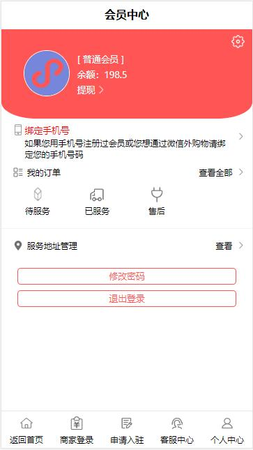
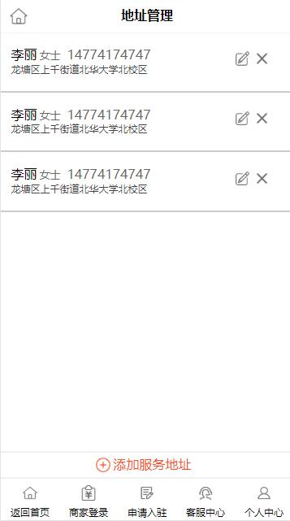
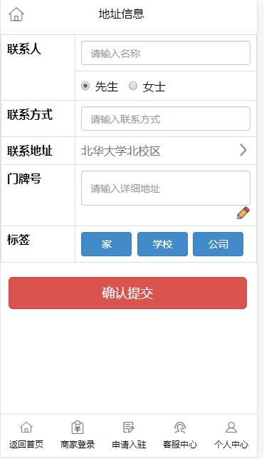

百姓家政网
========

1.项目分析：
--------
（1）本项目是为百姓的需求制作的网站，主页提供保洁、保姆、养老等服务需求，供百姓选择。
（2）菜单栏为商家提供商家申请入住、登录注册和个人中心等功能。
（3）同时提供给用户客服信息，方便用户解决问题。

2.实用技术：
--------
本项目用到h5,css3和ajax与后端进行数据交互，同时后端使用php语言操作数据库增删改查
实现了数据的异步获取和页面的随时切换。

3.效果图
--------
             

             

             
